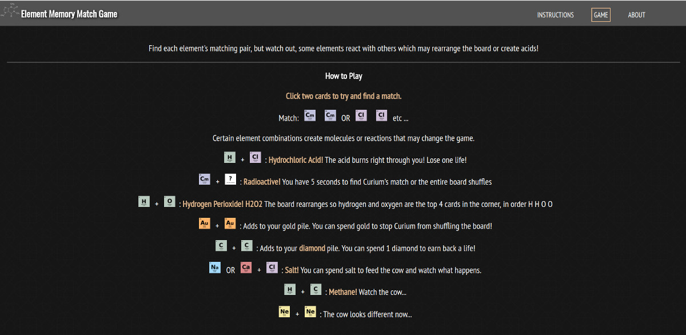
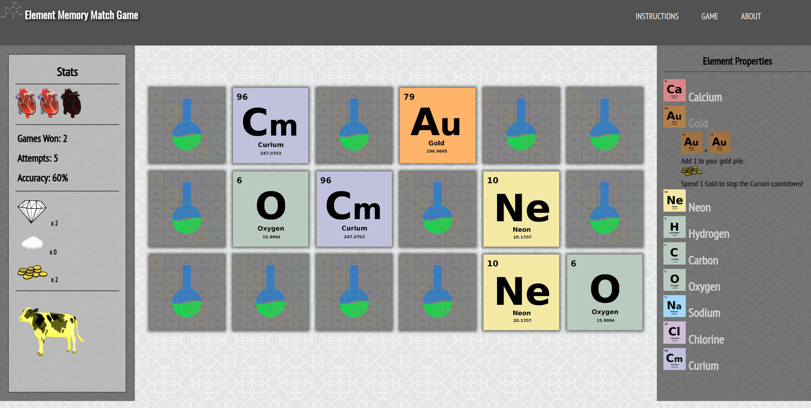

# Element Memory Match

 A 'reactive' memory match game with a twist! The player must find all the element matches before losing all three lives. However, the game board can change based on finding molecule combinations. For example, Hydrogen and Chlorine create hydrochloric acid, which causes the player to loose a life. The game incorporate animated effects, countdowns, and board shuffles.
 
 I was inspired to create a science game based on my background of being a science teacher. The periodic table is iconic to science, and I wanted to create a game where people could learn some information about elements and molecules by playing a fun game.

| |  | 

1. Read the instructions! This is important since there are many events that manipulate the board and game.
2. Click 'Game' to play
3. Click one card, then click a second card and hope for a match!
4. Depending on the cards you clicked, an event may occur. If an event happens, there will be orange text to notify you
5. Play until you win or burned by Hydrochloric Acid too many times!

### Prerequisites

* Python3
* Flask
* virtualenv

## Deployment with Heroku 

* Sign up for an account
```
heroku login
``` 
```
git clone https://github.com/[github username]/[repo-name].git
``` 
```
cd [folder name]
```
```
heroku create
```
```
git push heroku master
```
```
heroku ps:scale web=1
```
```
heroku open
```

## Built With

* Flask
* Python
* Jinja2
* Javascript
* HTML5
* CSS3


## Authors

* Andrea Wayte - *Developer* - [Portfolio Website](http://www.andreawayte.com)
* Vetronus - Flask template creater 

## License and Usage

This project is free to use though can not be copied. However, if you want to contribute, read the next section.  

## License and Usage

This project is open-source and is available for contributions. Fork the repo and create a new branch, make some modifications the create a pull request! Keep in mind, this game is intended to help others learn about the elements. 

## Acknowledgments

* [Vetronus](https://github.com/Vetronus/heroku-flask-template) for making a rad flask template enabling easy deployment to Heroku!

